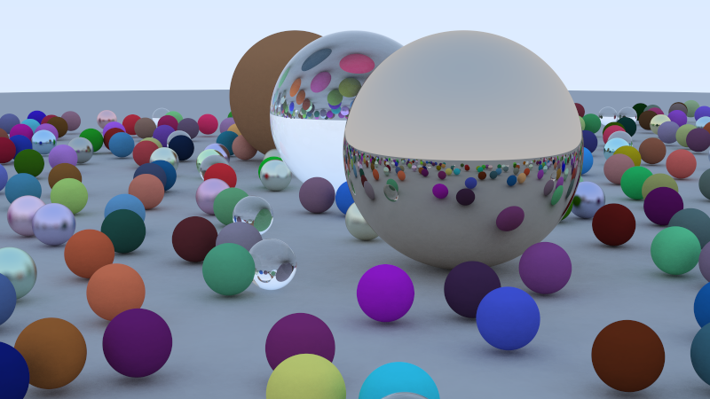
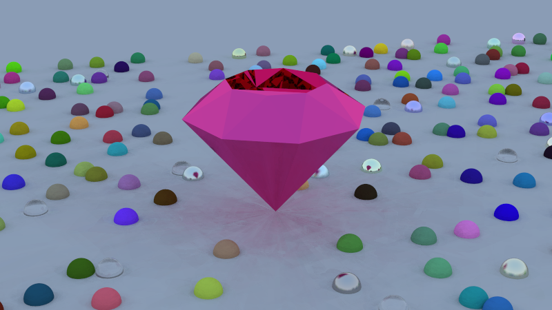

# A raytracer built in C++ (guided by [Ray Tracing in One Weekend](https://raytracing.github.io/))

### What does this code do?
Produces these images:

> The image created alongside the book

> The image created with my custom mesh import code

### [What is raytracing?](https://en.wikipedia.org/wiki/Ray_tracing_(graphics))
> In computer graphics, ray tracing is a rendering technique for generating an image by tracing the path of light as pixels in an image plane and simulating the effects of its encounters with virtual objects.

### What is this for?
This is a bite-sized project I worked on to potentially serve as a talking point in interviews as well as provide a concrete code sample. I followed along with the book [Ray Tracing in One Weekend](https://raytracing.github.io/), and although I understood and typed the code myself, guide rails were provided by the book for some of the project.

### What is unique in this project versus the project in the book [Ray Tracing in One Weekend](https://raytracing.github.io/)?
I implemented two main features on top of the raytracer built with the book:
1. Multi-threaded the program for 4x speedup in most cases
2. Custom mesh import (in this case, I 3D-modeled a gem)

Feature 1. is a fairly simple implementation, an allows for a linear speedup for how many CPU cores you throw at it.

Feature 2. is much more involved, and serves as my main talking point when discussing this project. You can read more about this below.

### What is feature 2. (custom mesh import), and why is it special?
See the files inside import_mesh.

### What code should I review?
The code in these files is fully written by myself and should be referenced when considering my problem solving ability/technique:
TODO: Link files

## Quickstart Guide
There are 2 ways to run the program. First, if you are on Windows you can try the TODO: [.exe release](https://www.google.com). There are a few extra steps here, so be sure to read the section below. Second, you can compile the code yourself. If you are on Linux, I assume you can figure this out (the Compile on Windows section could give you some pointers if you get stuck). Finally, I have also written a guide to compiling on Windows.

### The .exe release (Windows)
TODO: Write section

### Compiling on Windows
TODO: Write section

